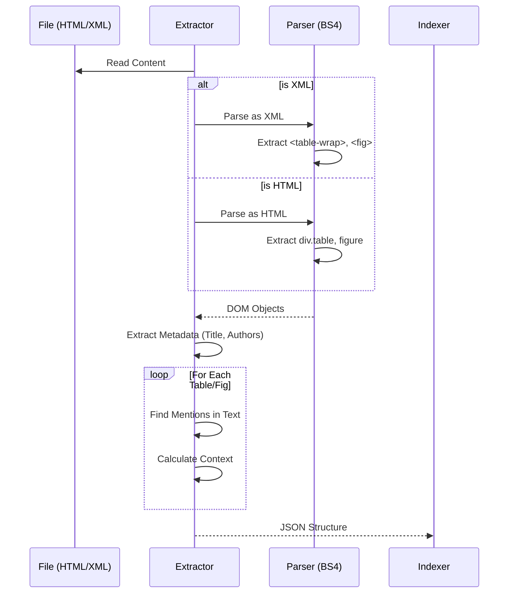

# Architettura del Sistema

Questo documento illustra l'architettura tecnica del motore di ricerca "SciSearch", descrivendo i flussi di dati, i componenti principali e le scelte progettuali.

## Panoramica High-Level

Il sistema è progettato come una pipeline ETL (Extract, Transform, Load) che alimenta un motore di ricerca basato su Elasticsearch, esposto tramite un'API Flask e un'interfaccia Web.

```mermaid
graph TD
    User[Utente] -->|Ricerca & Filtri| UI[Web UI (Streamlit/Flask)]
    UI -->|API Call| Backend[Flask Server (app.py)]
    Backend -->|Query DSL| ES[(Elasticsearch)]
    
    subgraph Data Pipeline
        S_Arxiv[Scraper ArXiv] -->|HTML| RawData[Data Storage (Local)]
        S_PubMed[Scraper PubMed] -->|XML| RawData
        RawData -->|Parse| Extractor[Extractor (BeautifulSoup)]
        Extractor -->|Structured Dict| Indexer[Indexer.py]
        Indexer -->|Bulk Index| ES
    end
```

## 1. Data Ingestion Layer (Scrapers)

Il livello di acquisizione dati è responsabile del download dei documenti scientifici.

### Componenti:
*   **`src/scrapers/arxiv_scraper.py`**:
    *   Interroga l'API di ArXiv per trovare paper rilevanti (es. query "speech to text").
    *   Scarica la versione HTML (generata via LaTeXML) se disponibile, altrimenti tenta il download da *ar5iv*.
*   **`src/scrapers/pubmed_scraper.py`**:
    *   Utilizza `Bio.Entrez` (Biopython) per interrogare PubMed Central (PMC).
    *   Filtra solo per articoli "Open Access".
    *   **Decisione Chiave**: Scarica file **XML** invece di HTML. L'HTML di PMC è spesso protetto da blocchi anti-bot (403 Forbidden), mentre l'API Entrez fornisce XML strutturato legalmente e in modo affidabile.

## 2. Extraction & Transformation Layer

Questo è il cuore della logica di business, dove i documenti grezzi vengono trasformati in oggetti indicizzabili.

### Logica di Estrazione (`src/extraction/extractor.py`)
Utilizza il pattern *Strategy* (implicito) per gestire formati diversi:

1.  **Detection**: Determina il parser in base all'estensione (`.xml` vs `.html`).
2.  **Parsing**:
    *   **PubMed (XML)**: Naviga l'albero XML cercando tag semantici come `<table-wrap>`, `<fig>`, `<abstract>`, `<contrib-group>` (autori).
    *   **ArXiv (HTML)**: Analizza il DOM cercando classi CSS specifiche generate dai convertitori LaTeX (es. `ltx_table`, `ltx_figure`).
3.  **Context Mapping**:
    *   Associa a ogni Tabella/Figura i paragrafi di testo che la citano.
    *   **Tecnica**: Cerca link espliciti (es. `<a href="#fig1">`) e *keyword overlap* (intersezione di parole tra didascalia e contenuto del paragrafo).



## 3. Storage & Indexing Layer

Utilizza **Elasticsearch** come database NoSQL e motore di ricerca.

### Schema Dati (`src/indexing/index_manager.py`)
Il modello dati "appiattisce" la gerarchia del documento in tre indici separati per massimizzare la ricercabilità:

1.  **`articles`**: Contiene il testo completo e i metadati.
    *   `_id`: Paper ID (es. "2306.12345" o "PMC123456").
    *   `source`: Keyword ("arxiv", "pubmed") per il filtraggio.
2.  **`tables`**:
    *   Oggetto di prima classe.
    *   Campi: `caption`, `body` (contenuto celle), `context_paragraphs`.
    *   Link al padre: `paper_id`.
3.  **`figures`**:
    *   Simile alle tabelle, ma contiene `url` dell'immagine.

**Perché tre indici?**
Ci permette di rispondere a query specifiche come *"trova tabelle che contengono 'accuracy' con risultati superiori al 90%"* senza rumore dal testo generale dell'articolo.

## 4. Presentation Layer (UI)

*   **Backend**: `Flask` (Python). Gestisce routing, chiamate a Elasticsearch e proxy per le immagini (per aggirare CORS o hotlinking protection di ArXiv).
*   **Frontend**: HTML5 + Vanilla JS + CSS3 (Design System personalizzato).
*   **Features Chiave**:
    *   **Source Switcher**: Sidebar persistente per filtrare per datasource.
    *   **Context Expansion**: UI interattiva per espandere/collassare i paragrafi di contesto citati.

