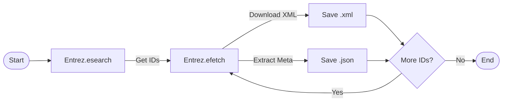
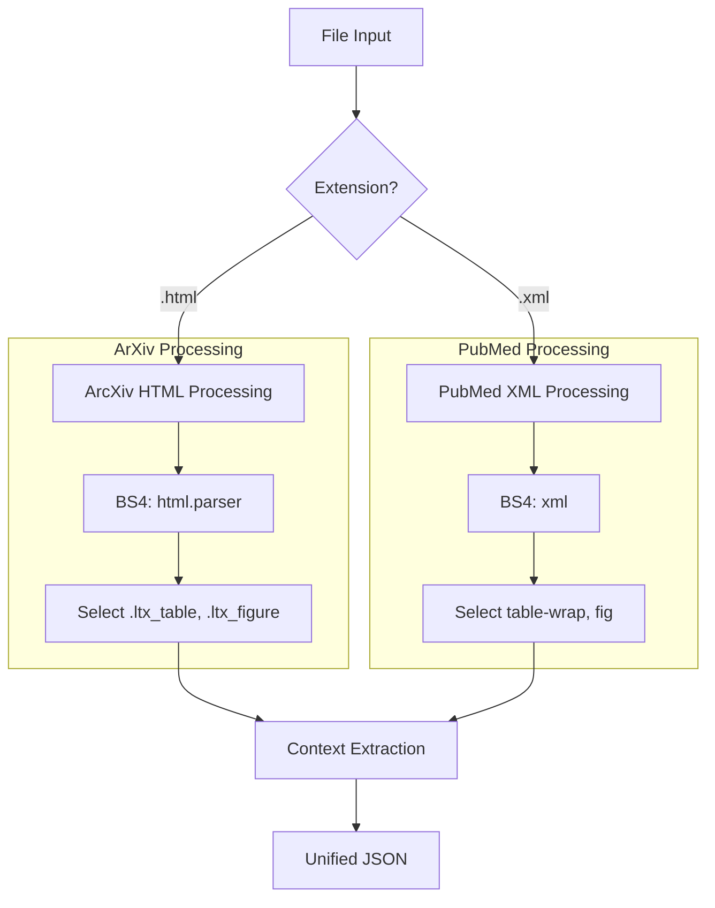

#  Dettagli Implementativi & Code Analysis

Questo documento fornisce una spiegazione approfondita dei moduli principali del codice sorgente di **SciSearch**, un motore di ricerca semantico per articoli scientifici.

---

## 1. Modulo Scraper 

Il sistema utilizza due scraper distinti per massimizzare la qualità dei dati scaricati.

### A. PubMed Scraper (`src/scrapers/pubmed_scraper.py`)
Gestisce il download massivo da **PubMed Central (PMC)**, preferendo il formato XML per la sua struttura semantica superiore.

*   **Tecnologia**: `Bio.Entrez` (Biopython).
*   **Strategia di Rispetto**: Implementa un `time.sleep(0.34)` tra le richieste per rispettare le policy NCBI (max 3 req/sec).
*   **Workflow**:



### B. ArXiv Scraper (`src/scrapers/arxiv_scraper.py`)
Poiché ArXiv non fornisce HTML via API, questo scraper agisce come un client web intelligente.

*   **Tecnologia**: `arxiv` (API wrapper) + `requests`.
*   **Fallback Strategy**:
    1.  Tenta il download diretto da `arxiv.org/html/{id}`.
    2.  Se fallisce (es. 403 Forbidden o 404), tenta il mirror `ar5iv.org`.
    3.  Salva l'HTML localmente per preservare la struttura DOM originale.

---

## 2. Modulo Extraction (`src/extraction/extractor.py`) 

La classe `Extractor` è il cuore dell'elaborazione semantica. Utilizza un approccio ibrido per normalizzare dati eterogenei (HTML vs XML) in un formato unificato.

### Architecture: The Parser Router
Il metodo `process_file` decide quale strategia di parsing utilizzare in base all'estensione del file:



### Context Extraction Algorithm 
Per ogni oggetto estratto (Tabella o Figura), il sistema deve identificare *dove* se ne parla nel testo. Questo permette all'utente di cercare "risultati accuracy" e trovare la Tabella 1 perché il paragrafo che la cita contiene quella parola.

L'algoritmo (`_post_process_context`) opera in due fasi:

1.  **Link Detection (Hard Link)**:
    *   Cerca nel DOM tag `<a>` che puntano all'ID dell'oggetto (es. `<a href="#tbl1">`).
    *   *Precisione*: 100%.

2.  **Keyword Matching (Soft Link)**:
    *   Se non ci sono link espliciti (comune in HTML convertito male), scansiona tutti i paragrafi.
    *   Cerca pattern come "Table 1", "Tab. 1", "Figure 2".
    *   Calcola uno **Jaccard Similarity Score** tra le parole della didascalia e quelle del paragrafo.

---

## 3. Indicizzazione (`src/indexing/`) 

Il sistema utilizza **Elasticsearch** con uno schema multi-indice per ottimizzare le performance di ricerca.

### Schema Dati (`index_manager.py`)

| Indice | Scopo | Campi Chiave |
| :--- | :--- | :--- |
| `articles` | Ricerca Full-text & Metadata | `title`, `abstract`, `full_text`, `authors`, `source` |
| `tables` | Ricerca Dati Tabulari | `caption`, `body` (celle), `context_paragraphs`, `paper_id` |
| `figures` | Ricerca Visuale | `caption`, `url`, `context_paragraphs`, `paper_id` |

**Decisione Architetturale**:
Separare `tables` e `figures` in indici propri permette query molto specifiche (es. *"trova tabelle che menzionano il dataset MNIST"*) senza essere inquinati dal rumore del testo generico degli articoli.

### Batch Processing (`indexer.py`)
Utilizza l'API `bulk` di Elasticsearch per l'inserimento massivo.
```python
# Pseudo-codice del loop di indicizzazione
actions = []
for paper in papers:
    data = extractor.extract(paper)
    actions.append(create_article_doc(data))
    actions.extend(create_table_docs(data['tables']))
    actions.extend(create_figure_docs(data['figures']))
    
    if len(actions) > 500:
        helpers.bulk(es, actions) # Commit massivo
```

---

## 4. Web Application (`src/ui/`) 

L'interfaccia utente è costruita per la velocità e la chiarezza.

### Backend (Flask)
*   **API REST**: Espone endpoint `/api/search` e `/api/stats`.
*   **Elasticsearch DSL**: Traduce le richieste frontend in query JSON complesse per ES.
    *   *Esempio*: Una ricerca per "cancer" con filtro "PubMed" diventa una `bool` query con `must: match(content)` e `filter: term(source='pubmed')`.

### Frontend (Vanilla JS + CSS Grid)
*   **Assenza di Framework**: Scritto in JS puro per massima leggerezza e controllo.
*   **Sidebar Navigation**: Gestisce lo stato globale (`currentSource`, `currentIndex`) e aggiorna dinamicamente i risultati.
*   **Image Proxy**: Poiché ArXiv blocca l'hotlinking delle immagini (ritorna 403 Forbidden), il server Flask agisce da proxy:
    1.  UI richiede immagine a `/api/image_proxy?url=...`
    2.  Flask scarica l'immagine (con User-Agent corretto)
    3.  Flask serve l'immagine al browser.

---
